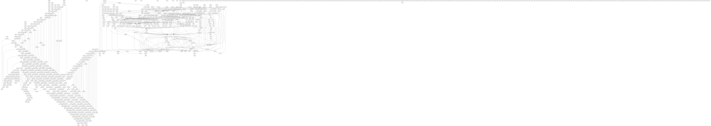

# SAT-Solver

## Running the SAT-Solver

Once built via `cargo build --release` the solver can be executed the following:

`./target/release/sat [MODE] [FILEPATH] [FILEPATH] --heuristic [HEURISTIC] [FLAGS]`

### MODE

- dpll
- cdcl

### HEURISTIC

Supported heuristics are:

- arbitrary
- dlis
- dlcs
- mom
- boehm
- jeroslaw_wang
- vsids
- custom

### Flags

| short | long               | description                                  |
| ----- | ------------------ | -------------------------------------------- |
| -H|--heuristic |Specify the heuristic to use [default: arbitrary]|
| -d|--depth|Shows the depth of the search tree|
| -k|--k |Argument for k-bounded learning [default: 10]|
| -m|--m |Argument for m-size relevance based learning [default: 10]|
| -s|--subsumed_clauses|Eliminates subsumed clauses|
| -f|--flamegraph|Specify whether to create a flamegraph|
| -r|--restarts_threshold |Specify the conflict threshold for a restart|
| -l|--luby|Use luby sequence for restarts|
| -F|--restart_factor |Specify the factor for restarts|
| -D|--DRUP|Output in DRUP format|
| -h|--help|Print help|
| -V|--version|Print version|

## CPU Time Measurement

To measure the CPU time for each `.cnf` file in `src/inputs`, run the `cputime` binary:

`cargo run --bin cputime -- --time-limit [TIME-LIMIT] --heuristic [HEURISTIC]`

### TIME-LIMIT

Time-Limit arguments:

- true: 60sec execution time frame (default value)
- false: measures the duration of the execution without timeout

## Plotting

To create the plots for the existing `.csv` files in `src/cputime`, run the `plot` binary:
`cargo run --bin plot`

## Running the tests

When cloning make sure to also sync the submodule which includes testfiles:

`git submodule update --init --recursive`

Run the tests using cargo:

`cargo test --package sat_solver --lib -- cdcl --nocapture`

# Performance

We were able to solve 199 of the 202 cnfs from exercise 2 correctly (same var assignment as minisat) with a timout of 60 seconds.
The remaining three problems could be solved in just over a minute.

Average time for all 202 problems: 1.4s with vsids, without restarts. (`gruppe-m-2/src/cputime/60sec_arbitrary.csv`)
Average time for all 202 problems: 12.17s without vsids, without restarts. (`gruppe-m-2/src/cputime/60sec_vsids.csv`)

The problems from 2006th sat competition we tried to solve took no longer than 15mins.

# Team Responsibilities

**Noel:**

- [x] Fix issue with Conflict analysis
- [x] Subsumed Clauses
- [x] Restarts
- [x] Drup logging

**Laura:**

- [x] Implication Graph
- [x] Conflict analysis

**Flo:**

- [x] 2-Watched Literals
- [x] Fix/Update impl. graph while setting vars
- [x] Fix/Rewrite Conflict analysis
- [x] Non-chron backtracking
- [x] Test + Debug non-chronological backtracking
- [x] Check whether unit clauses can occur in conflict analysis
- [x] Check impl for set_var in respect to unit clauses
- [x] Pure literal elimination as preprocessing
- [x] Output valid DIMACS solution
- [ ] VSIDS performance

# Our favourite Implication Graph during debugging

